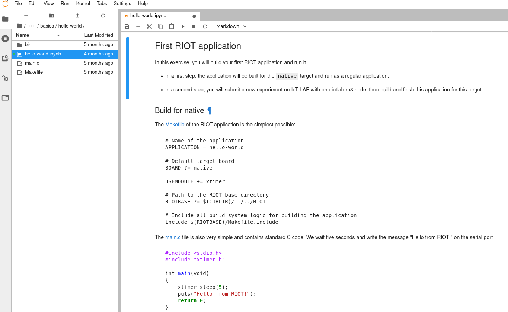

class: center, middle

# MicroAI Interview exercises

---

## Your working environment

- The [FIT IoT-LAB](https://www.iot-lab.info) testbed will be used to perform
  the exercises that require hardware

- [Register for an account](https://www.iot-lab.info/testbed/signup) on the FIT IoT-LAB testbed

- Get started with RIOT by following the [RIOT online course](https://riot-os.github.io/riot-course/slides/02-getting-started)

- All exercises are performed online in Jupyter Notebooks

.center[
    
]

---

## About the Jupyter Notebooks

.center[
Available at **https://labs.iot-lab.info**

**Short demo: discover Jupyterlab notebooks!**
<form class=notebook>
    <input class=login id="login_start" type="text" oninput="check_login('login_start', 'launcher_start')" placeholder="Enter your IoT-LAB login">
    <input class=launcher id="launcher_start" type="button" value="Launch notebook" onclick="open_notebook('login_start', 'start.ipynb')">
</form>
]

---

## Exercise: Your first experiment on IoT-LAB

Let's launch a simple experiment on IoT-LAB!

.center[
<form class=notebook>
    <input class=login id="login_experiment" type="text" oninput="check_login('login_experiment', 'launcher_experiment')" placeholder="Enter your IoT-LAB login">
    <input class=launcher id="launcher_experiment" type="button" value="Launch notebook" onclick="open_notebook('login_experiment', 'first-experiment/first-experiment.ipynb')" disabled>
</form>
]

---

## Exercise: your first RIOT application

Let's build and run our first RIOT application !  

.center[
<form class=notebook>
    <input class=login id="login_hello" type="text" oninput="check_login('login_hello', 'launcher_hello')" placeholder="Enter your IoT-LAB login">
    <input class=launcher id="launcher_hello" type="button" value="Launch notebook" onclick="open_notebook('login_hello', 'riot/basics/hello-world/hello-world.ipynb')" disabled>
</form>
]

---

## Exercise: read sensor data using the shell

Let's write an advanced RIOT application to read sensors values.
 

The application will use advanced techniques to read some data in a separate thread and use mutexes to synchronize the threads!

 
.center[
<form class=notebook>
    <input class=login id="login_sensors" type="text" oninput="check_login('login_sensors', 'launcher_sensors')" placeholder="Enter your IoT-LAB login">
    <input class=launcher id="launcher_sensors" type="button" value="Launch notebook" onclick="open_notebook('login_sensors', 'riot/basics/sensors/sensors.ipynb')" disabled>
</form>
]

---

## Exercise: communication with a LwM2M server

Interact with a Leshan server using LwM2M

.center[
<form class=notebook>
    <input class=login id="login_lwm2m" type="text" oninput="check_login('login_lwm2m', 'launcher_lwm2m')" placeholder="Enter your IoT-LAB login">
    <input class=launcher id="launcher_lwm2m" type="button" value="Launch notebook" onclick="open_notebook('login_lwm2m', 'riot/networking/lwm2m/lwm2m.ipynb')" disabled>
</form>
]

---

## Exercise: use LoRaWAN to publish data to the web

Integrate a RIOT application with MyDevices Cayenne to publish sensor data on a web dashboard!

.center[
<form class=notebook>
    <input class=login id="login_ttn_cayenne_lpp" type="text" oninput="check_login('login_ttn_cayenne_lpp', 'launcher_ttn_cayenne_lpp')" placeholder="Enter your IoT-LAB login">
    <input class=launcher id="launcher_ttn_cayenne_lpp" type="button" value="Launch notebook" onclick="open_notebook('login_ttn_cayenne_lpp', 'riot/lorawan/ttn-cayenne-lpp/ttn-cayenne-lpp.ipynb')" disabled>
</form>
]
